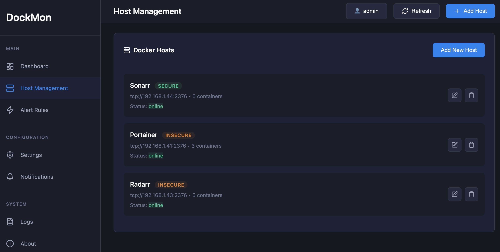
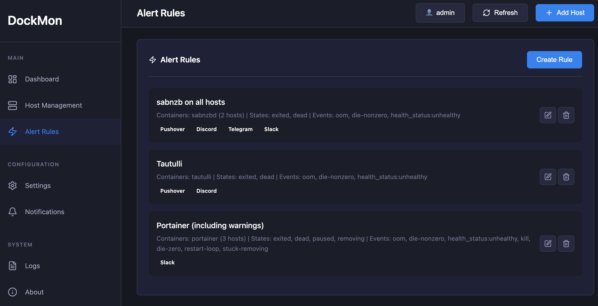
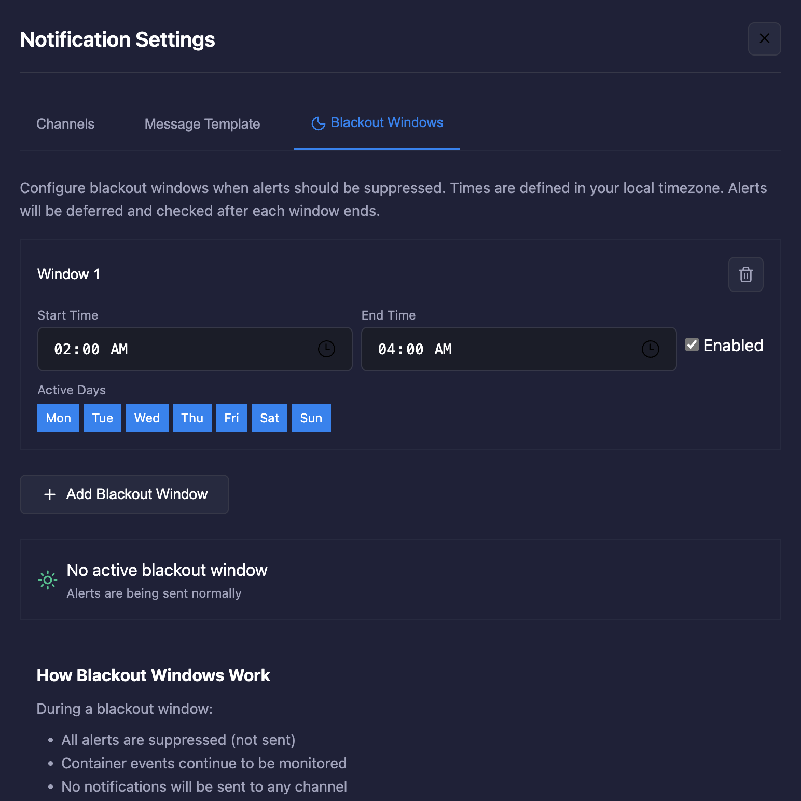

# DockMon

A comprehensive Docker container monitoring and management platform with real-time monitoring, intelligent auto-restart, multi-channel alerting, and complete event logging.


## Screenshots

### Dashboard Overview

*Real-time monitoring of multiple Docker hosts with container status and auto-restart controls*

### Docker Hosts Management

*Manage multiple Docker hosts with connection status monitoring*

### Alerts

*Flexible alert system with multiple notification channels and methods*

### Blackout Window

*Schedule quiet hours to suppress notifications during maintenance windows*

## Core Features

### **Multi-Host Docker Monitoring**
- Monitor containers across unlimited Docker hosts (local and remote)
- Real-time container status tracking with WebSocket updates
- Support for TCP/TLS and Unix socket connections
- Automatic host connection health monitoring

### **Customizable Widget Dashboard**
- **Drag-and-drop interface** for intuitive dashboard customization
- **Resizable widgets** for personalized dashboard layouts
- **Persistent layout** saves your custom arrangement
- **Lock/unlock mode** to prevent accidental changes
- **12-column responsive grid** adapts to any screen size

### **Intelligent Auto-Restart System**
- Per-container auto-restart configuration
- Configurable retry attempts (0-10) and delays (5-300 seconds)
- Smart failure detection with exponential backoff
- Automatic disable after max attempts reached
- Comprehensive logging of all restart attempts

### **Advanced Alerting & Notifications**
- **Multi-channel support:** Discord, Slack, Telegram, Pushover
- **Customizable alert templates** with 15+ variables for personalized messages
- **Flexible alert rules** with regex pattern matching
- **Cooldown periods** to prevent notification spam
- **State-based triggers** (container start, stop, crash, etc.)
- **Real-time notification delivery** with success tracking
- **Blackout windows (Quiet Hours)** for scheduled maintenance periods

### **Comprehensive Event Logging**
- **Complete audit trail** of all container and system events
- **Structured event categorization** (container, host, system, alert, notification)
- **Severity levels** (debug, info, warning, error, critical)
- **Correlation tracking** for related events
- **Performance metrics** with operation timing
- **Advanced filtering and search** capabilities
- **Automatic cleanup** with configurable retention

### **Container Management**
- Start, stop, restart containers remotely
- View real-time container logs
- Execute commands inside containers
- Live container statistics (CPU, memory, network, I/O)
- Container lifecycle management

### **Modern Architecture**
- **FastAPI backend** with async/await for high performance
- **WebSocket real-time updates** for instant UI refresh
- **SQLite database** for persistent configuration and event storage
- **Modern dark UI** with professional design
- **Mobile-friendly responsive design** with native mobile navigation and optimized layouts
- **Cross-platform compatibility** - works seamlessly on desktop, tablet, and mobile devices

## Quick Start

### Docker Deployment

Deploy DockMon as a single all-in-one container:

```bash
git clone https://github.com/darthnorse/dockmon.git
cd dockmon
docker compose up -d
```

**Access:** `https://localhost:8001` (accept the self-signed certificate warning)

**Automatic Setup:**
- DockMon automatically configures local Docker monitoring on first run
- No manual host configuration needed for local containers
- For remote Docker hosts, see [Docker Remote Host Monitoring](#docker-remote-host-monitoring)

### unRAID Installation

1. **Install via Community Applications** (Coming Soon) or build locally:
```bash
# Clone and build DockMon
git clone https://github.com/darthnorse/dockmon.git
cd dockmon
docker build -f docker/Dockerfile -t dockmon:latest .

# Run the container
docker run -d \
  --name=dockmon \
  -p 8001:443 \
  -v dockmon_data:/app/data \
  -v /var/run/docker.sock:/var/run/docker.sock \
  --restart unless-stopped \
  dockmon:latest
```

2. **Access DockMon** at `https://your-unraid-ip:8001`

3. **Automatic Setup:**
   - DockMon automatically configures local Docker monitoring on first run
   - No manual host configuration needed for local containers
   - For remote Docker hosts, see [Docker Remote Host Monitoring](#docker-remote-host-monitoring)

**What's Included:**
- `dockmon` - All-in-one container with:
  - Nginx frontend with HTTPS
  - FastAPI backend with SQLite database
  - Supervisor process management
  - Automatic Docker socket mounting for local monitoring

**Security Note:** DockMon is designed to run as a Docker container for optimal security and isolation. Running the backend directly on a host system is not supported due to security considerations.

## Configuration & Setup

### First Time Setup

1. **Initial Login**
   - Navigate to `https://localhost:8001` (or your configured URL)
   - Accept the self-signed certificate warning
   - Login with default credentials:
     - **Username:** `admin`
     - **Password:** `dockmon123`
   - **Important:** You will be required to change the password immediately on first login

2. **Add Docker Hosts**
   - **Auto-Configuration:** DockMon automatically configures local Docker monitoring on first startup (no manual setup needed)
   - To add additional hosts, click "Add Host" in the dashboard
   - **Host Configuration:**
     - **Name:** Any descriptive name (e.g., "Production Server", "NAS Docker")
     - **URL:**
       - Local socket: `unix:///var/run/docker.sock`
       - Remote TCP: `tcp://192.168.1.100:2375` (insecure)
       - Remote TLS: `tcp://192.168.1.100:2376` (with certificates)
     - **Certificates** (for TLS only): Paste contents of CA, client cert, and client key files
     - Click "Test Connection" then "Save"
   - **For remote hosts setup:** See [Docker Remote Host Monitoring](#docker-remote-host-monitoring)

3. **Configure Notification Channels** (Optional)
   - Go to Settings → Notifications
   - Set up Discord, Slack, Telegram, and/or Pushover

4. **Create Alert Rules** (Optional)
   - Go to Settings → Alert Rules
   - Define which containers trigger notifications

### Password Management

#### Change Password
**Via Web Interface (Recommended):**
- Navigate to Settings → Account
- Enter your current password and new password
- Click "Change Password"

#### Reset Password (If Forgotten)
If you forget your password, you can reset it using the command-line tool:

```bash
# Auto-generate new password
docker exec dockmon python /app/backend/reset_password.py admin

# Set specific password
docker exec dockmon python /app/backend/reset_password.py admin --password NewPassword123

# Interactive mode (prompts for password)
docker exec -it dockmon python /app/backend/reset_password.py admin --interactive
```

### Notification Channels Setup

#### Slack
1. Create an Incoming Webhook in your Slack workspace:
   - Go to https://api.slack.com/apps
   - Click "Create New App" → "From scratch"
   - Choose your workspace
   - Go to "Incoming Webhooks" → Enable → "Add New Webhook"
   - Select a channel and copy the webhook URL

2. In DockMon:
   - Go to Settings → Notifications
   - Add new channel with type "Slack"
   - Paste your webhook URL
   - Test the connection

#### Discord
1. Create a webhook in your Discord server:
   - Right-click on a channel → Edit Channel → Integrations → Webhooks
   - Create a new webhook and copy the URL

2. In DockMon:
   - Add new channel with type "Discord"
   - Paste your webhook URL

#### Telegram
1. Create a bot via @BotFather on Telegram
2. Get your chat ID (message @userinfobot)
3. In DockMon: Add bot token and chat ID

#### Pushover
1. Register at pushover.net
2. Create an application to get app token
3. In DockMon: Add app token and user key

### Custom Alert Templates

DockMon supports fully customizable notification messages using template variables:

#### Available Variables
- `{CONTAINER_NAME}` - Container name
- `{CONTAINER_ID}` - Short container ID
- `{HOST_NAME}` - Docker host name
- `{HOST_ID}` - Host identifier
- `{OLD_STATE}` - Previous container state
- `{NEW_STATE}` - Current container state
- `{IMAGE}` - Docker image name
- `{TIMESTAMP}` - Full timestamp (YYYY-MM-DD HH:MM:SS)
- `{TIME}` - Time only (HH:MM:SS)
- `{DATE}` - Date only (YYYY-MM-DD)
- `{RULE_NAME}` - Alert rule that triggered
- `{EVENT_TYPE}` - Docker event type (if applicable)
- `{EXIT_CODE}` - Container exit code (if applicable)

#### Example Templates

**Default (Detailed):**
```
🚨 **DockMon Alert**

**Container:** `{CONTAINER_NAME}`
**Host:** {HOST_NAME}
**State Change:** `{OLD_STATE}` → `{NEW_STATE}`
**Image:** {IMAGE}
**Time:** {TIMESTAMP}
**Rule:** {RULE_NAME}
```

**Simple:**
```
Alert: {CONTAINER_NAME} on {HOST_NAME} changed from {OLD_STATE} to {NEW_STATE}
```

**Minimal:**
```
{CONTAINER_NAME}: {NEW_STATE} at {TIME}
```

To customize your alert template:
1. Go to Settings → Notifications
2. Click the "Message Template" tab
3. Enter your custom template using any combination of variables
4. Save your changes

### Blackout Windows (Quiet Hours)

Blackout windows allow you to suppress all alerts during scheduled maintenance periods or quiet hours. This prevents unnecessary notifications when you're performing planned maintenance or updates.

#### How Blackout Windows Work

**During a blackout window:**
- All alerts are suppressed (not sent to any notification channel)
- Container events continue to be monitored and logged
- The system tracks container states but doesn't send notifications

**When a blackout window ends:**
- DockMon automatically checks the current state of all containers
- Alerts are sent for any containers found in problematic states (exited, dead, paused, etc.)
- This ensures you're notified of any issues that occurred during maintenance

#### Configuration

To set up blackout windows:
1. Go to Settings → Notifications
2. Click the "🌙 Quiet Hours" tab
3. Add one or more blackout windows with:
   - **Name**: Descriptive name (e.g., "Nightly Maintenance", "Weekend Updates")
   - **Time Range**: Start and end times (24-hour format)
   - **Days**: Select which days of the week to apply
   - **Enabled**: Toggle to activate/deactivate the window

#### Best Practices

⚠️ **Important:** When using blackout windows, configure your alert rules to monitor both **events AND states**. This ensures:
- **Events**: Trigger immediate alerts when container state changes occur (e.g., die, stop, restart)
- **States**: Continuously monitor container health and trigger alerts based on current state (e.g., exited, dead, paused)

**Example Alert Rule Configuration:**
```
✅ Monitor Events: container_stop, container_die
✅ Monitor States: exited, dead
```

**Why both?**
- During normal operations, **events** provide instant notification when something goes wrong
- During blackout windows, alerts are suppressed, but **state monitoring** checks container health when the blackout ends
- If containers are still in problematic states (exited, dead, etc.) after the blackout, you'll be notified immediately

This dual approach ensures you won't miss critical issues, whether they occur during normal operations or maintenance windows.

#### Use Cases

- **Scheduled maintenance**: Suppress alerts during planned Docker updates or system maintenance
- **Batch deployments**: Prevent alert spam during large-scale container updates
- **Night hours**: Avoid non-critical alerts during off-hours
- **Testing periods**: Disable alerts while testing new configurations

## Docker Remote Host Monitoring

To monitor Docker hosts remotely, you need to configure the Docker daemon to accept secure remote connections.

⚠️ **SECURITY WARNING:** Exposing Docker's API without TLS gives anyone who can reach the port COMPLETE control over your host system. They can:
- Run any container with host privileges
- Access all files on your system
- Install cryptocurrency miners
- Compromise your entire network

**Always use mTLS (mutual TLS) for production systems.**

### Method 1: Secure Setup with mTLS (Recommended)

mTLS provides mutual authentication, encrypted communication, and certificate-based access control.

#### Quick Setup with Our Script

Run our automated script on your Docker host to generate certificates and see configuration instructions:

```bash
# Download and run the script
curl -sSL https://raw.githubusercontent.com/darthnorse/dockmon/main/scripts/setup-docker-mtls.sh | bash

# Or run with custom options:
./scripts/setup-docker-mtls.sh --host myserver.local --ip 192.168.1.100
```

**What the script does:**
1. Generates CA, server, and client certificates
2. Detects your system type (systemd Linux, unRAID, Synology, etc.)
3. Shows you EXACTLY what to add to your system's Docker configuration
4. Provides the certificates to use in DockMon

**After running the script:**
1. Follow the configuration instructions it provides for your specific system
2. Copy the certificate contents (the script shows where they're stored)
3. In DockMon, add the remote host:
   - **URL**: `tcp://your-host:2376`
   - **CA Certificate**: Paste contents of `ca.pem`
   - **Client Certificate**: Paste contents of `client-cert.pem`
   - **Client Key**: Paste contents of `client-key.pem`

#### What the Script Does vs Manual Steps

**The script:**
- ✅ Generates all certificates (CA, server, client)
- ✅ Creates configuration files for your system
- ✅ Shows you exact commands to run
- ❌ Does NOT modify your Docker daemon (you do this manually for security)

**You need to:**
- Follow the instructions the script provides
- Apply the Docker daemon configuration it generated
- Restart Docker service

#### Example: Linux with systemd

After running the script, it will show you commands like:

```bash
# 1. Copy certificates to system directory
sudo mkdir -p /etc/docker/certs
sudo cp ~/.docker/certs/{ca.pem,server-cert.pem,server-key.pem} /etc/docker/certs/
sudo chmod 400 /etc/docker/certs/*-key.pem

# 2. Apply the systemd override the script generated
sudo mkdir -p /etc/systemd/system/docker.service.d/
sudo cp ~/.docker/certs/docker-override.conf /etc/systemd/system/docker.service.d/override.conf

# 3. Restart Docker
sudo systemctl daemon-reload
sudo systemctl restart docker
```

#### Example: unRAID

After running the script, it will show you:

```bash
# 1. Stop Docker via Web UI
# 2. Edit /boot/config/docker.cfg and add:
DOCKER_OPTS="-H tcp://0.0.0.0:2376 --tlsverify --tlscacert=/boot/config/docker-tls/ca.pem --tlscert=/boot/config/docker-tls/server-cert.pem --tlskey=/boot/config/docker-tls/server-key.pem"
# 3. Start Docker via Web UI
```

#### Supported Systems

The script auto-detects and provides specific instructions for:
- **Linux with systemd** (Ubuntu, Debian, RHEL, Fedora) - TESTED
- **unRAID** - TESTED
- **Synology DSM** - UNTESTED, proceed with caution
- **QNAP** - UNTESTED, proceed with caution
- **TrueNAS** - UNTESTED, proceed with caution
- **Alpine Linux** - OpenRC configuration

### Method 2: Insecure Setup (Development Only)

⚠️ **NEVER USE IN PRODUCTION** - This exposes your entire system to anyone who can reach the port!

Only use this method for:
- Isolated test environments
- Local development on trusted networks
- Temporary debugging

#### For Linux with systemd

1. Create systemd override:
```bash
sudo systemctl edit docker
```

2. Add insecure TCP listener:
```ini
[Service]
ExecStart=
ExecStart=/usr/bin/dockerd -H unix:///var/run/docker.sock -H tcp://0.0.0.0:2375
```

3. Restart Docker:
```bash
sudo systemctl daemon-reload
sudo systemctl restart docker
```

#### For unRAID

1. Stop Docker: Settings → Docker → Set 'Enable Docker' to No → Apply
2. SSH and edit `/boot/config/docker.cfg`:
```bash
DOCKER_OPTS="-H tcp://0.0.0.0:2375"
```
3. Start Docker: Settings → Docker → Set 'Enable Docker' to Yes → Apply

#### Connect from DockMon

Add host with URL: `tcp://192.168.1.100:2375` (no certificates needed)

### Connection Formats

- **Local Docker**: `unix:///var/run/docker.sock`
- **Remote Insecure**: `tcp://192.168.1.100:2375`
- **Remote Secure (mTLS)**: `tcp://192.168.1.100:2376`

### Security Best Practices

1. **Always use mTLS for remote connections** - Never expose Docker API without TLS
2. **Rotate certificates regularly** - Generate new certificates every 90-365 days
3. **Protect private keys** - Set permissions to 400, never commit to git
4. **Use firewall rules** - Restrict port 2376 to specific IPs if possible
5. **Monitor access logs** - Check Docker logs for unauthorized access attempts
6. **Secure database storage** - DockMon automatically sets secure permissions (600) on the SQLite database containing certificates

#### Troubleshooting

**Connection Refused Error:**
```
Failed to establish a new connection: [Errno 111] Connection refused
```
- Verify Docker daemon is listening: `ss -tlnp | grep docker`
- Check firewall settings: `sudo ufw status` or `iptables -L`
- Test connectivity: `telnet <host-ip> 2376`

**Systemd Conflicts:**
If you get systemd socket activation conflicts, you're using daemon.json "hosts" on a systemd system. Remove the "hosts" line from daemon.json and use systemd override instead.

### Notification Channels Setup

#### Discord
```json
{
  "name": "Discord Alerts",
  "type": "discord",
  "config": {
    "webhook_url": "https://discord.com/api/webhooks/YOUR_WEBHOOK_URL"
  }
}
```

#### Telegram
```json
{
  "name": "Telegram Alerts",
  "type": "telegram",
  "config": {
    "bot_token": "YOUR_BOT_TOKEN",
    "chat_id": "YOUR_CHAT_ID"
  }
}
```

#### Pushover
```json
{
  "name": "Pushover Alerts",
  "type": "pushover",
  "config": {
    "app_token": "YOUR_APP_TOKEN",
    "user_key": "YOUR_USER_KEY"
  }
}
```

### Alert Rules Configuration

Create sophisticated alert rules with regex patterns:

```json
{
  "name": "Production Container Down",
  "container_pattern": "prod-.*",
  "trigger_states": ["exited", "dead"],
  "notification_channels": [1, 2],
  "cooldown_minutes": 15,
  "enabled": true
}
```

### Global Settings

- **Auto-restart attempts:** 0-10 retries
- **Retry delay:** 5-300 seconds between attempts
- **Polling interval:** How often to check container status
- **Event retention:** How long to keep event logs
- **Notification settings:** Global notification preferences

## Usage Examples

### Basic Workflow

1. **Add Docker Hosts**
   - Local Docker: `unix:///var/run/docker.sock`
   - Remote Docker: `tcp://192.168.1.100:2376` (with or without TLS)

2. **Configure Auto-Restart**
   - Enable per-container auto-restart
   - Set retry attempts and delay intervals
   - Monitor restart attempts in real-time

3. **Set Up Alerts**
   - Create notification channels (Discord, Telegram, Pushover)
   - Define alert rules with regex patterns
   - Test notifications before enabling

4. **Monitor & Manage**
   - View real-time container status
   - Restart, start, or stop containers remotely
   - View container logs and execute commands
   - Track all events in the comprehensive event log

## REST API Documentation

DockMon provides a comprehensive REST API for programmatic access:

### Core Endpoints

#### Container Management
```bash
# Get all containers
GET /api/containers

# Container actions
POST /api/hosts/{host_id}/containers/{container_id}/start
POST /api/hosts/{host_id}/containers/{container_id}/stop
POST /api/hosts/{host_id}/containers/{container_id}/restart

# Container logs and commands
GET /api/hosts/{host_id}/containers/{container_id}/logs?tail=100
POST /api/hosts/{host_id}/containers/{container_id}/exec
```

#### Host Management
```bash
# Manage Docker hosts
GET /api/hosts
POST /api/hosts
DELETE /api/hosts/{host_id}
```

#### Notification Channels
```bash
# Manage notification channels
GET /api/notifications/channels
POST /api/notifications/channels
PUT /api/notifications/channels/{channel_id}
DELETE /api/notifications/channels/{channel_id}
POST /api/notifications/channels/{channel_id}/test
```

#### Alert Rules
```bash
# Manage alert rules
GET /api/alerts
POST /api/alerts
DELETE /api/alerts/{rule_id}
```

#### Event Logging
```bash
# View and filter events
GET /api/events?category=container&severity=error&limit=50
GET /api/events/{event_id}
GET /api/events/correlation/{correlation_id}
GET /api/events/container/{container_id}
GET /api/events/host/{host_id}
GET /api/events/statistics
DELETE /api/events/cleanup?days=30
```

#### Settings
```bash
# Global configuration
GET /api/settings
POST /api/settings
```

### WebSocket Real-time Updates

Connect to `/ws` for real-time updates:

```javascript
const ws = new WebSocket('ws://localhost:8080/ws');

ws.onmessage = (event) => {
    const data = JSON.parse(event.data);

    switch(data.type) {
        case 'containers_update':
            // Handle container status updates
            break;
        case 'docker_event':
            // Handle Docker events
            break;
        case 'container_stats':
            // Handle real-time stats
            break;
    }
};
```

### API Authentication

DockMon uses session-based authentication with secure bcrypt password hashing:
- Session cookies with `httponly` and `secure` flags
- 12-round bcrypt for password hashing
- Password change required on first login (default: `admin`/`changeme`)
- Rate limiting on all authentication endpoints

All API endpoints (except `/health`) require authentication.

## Security Considerations

### 🔒 **Authentication & Access Control**

DockMon is designed as a **single-user system** with strong authentication:
- ✅ Session-based authentication with secure cookies
- ✅ Bcrypt password hashing (12 rounds)
- ✅ HTTPS-only access (self-signed cert included)
- ✅ Rate limiting on all endpoints
- ✅ Security audit logging for privileged actions
- ✅ Backend bound to localhost (127.0.0.1) - only accessible via Nginx

### ⚠️ **Docker Socket Access**

**IMPORTANT:** DockMon requires full access to the Docker socket to function:

```yaml
volumes:
  - /var/run/docker.sock:/var/run/docker.sock  # Required for container management
```

**This provides root-equivalent access to the host system.** A compromised DockMon instance could:
- Start/stop any containers
- Mount host filesystem
- Escalate to host root access

**Security implications:**
- ✅ This is **required by design** - DockMon cannot monitor/control Docker without it
- ⚠️ **Do NOT expose DockMon to the internet** - use VPN/SSH tunnel for remote access
- ⚠️ Use strong passwords and keep DockMon updated
- ✅ DockMon's authentication and localhost-only backend minimize attack surface

### 🌐 **Network Security**

**Deployment model:**
```
Internet → [VPN/SSH Tunnel] → HTTPS (port 8001) → Nginx → Backend (127.0.0.1:8080)
```

**What's exposed:**
- Port 8001 (HTTPS) - Nginx frontend with authentication required
- Backend is NOT exposed (localhost-only binding)

**Recommendations:**
- ✅ Use the included self-signed certificate for local/private use
- ✅ Replace with proper TLS certificate for production (see below)
- ⚠️ Do NOT expose port 8001 to the internet directly
- ✅ Use VPN (WireGuard/OpenVPN) or SSH tunnel for remote access
- ✅ Consider running behind a reverse proxy (Traefik, Caddy) with additional auth

### 🔐 **TLS Certificate**

DockMon includes a self-signed certificate that's auto-generated on first run. Your browser will show a security warning - this is **expected and safe for private use**.

**To replace with your own certificate:**

1. Replace the certificate files in the container:
```bash
docker cp your-cert.crt dockmon:/etc/nginx/certs/dockmon.crt
docker cp your-cert.key dockmon:/etc/nginx/certs/dockmon.key
docker exec dockmon nginx -s reload
```

2. Or mount your own certificates:
```yaml
volumes:
  - ./certs/your-cert.crt:/etc/nginx/certs/dockmon.crt:ro
  - ./certs/your-cert.key:/etc/nginx/certs/dockmon.key:ro
```

3. For Let's Encrypt, use a reverse proxy like Caddy or Traefik in front of DockMon

### 📝 **Security Best Practices**

**Required:**
- ✅ Change default password immediately after first login
- ✅ Use strong passwords (12+ characters, mixed case, numbers, symbols)
- ✅ Keep DockMon container updated
- ✅ Do NOT expose directly to the internet

**Recommended:**
- ✅ Run DockMon on a dedicated management network
- ✅ Use a VPN for remote access
- ✅ Regularly review security audit logs (Settings → Security Audit)
- ✅ Monitor rate limiting statistics
- ✅ Use TLS for remote Docker host connections
- ✅ Backup the database regularly (`/app/data/dockmon.db`)

**Nice to Have:**
- Consider running behind additional reverse proxy with auth
- Implement network segmentation (separate Docker network)
- Use Docker socket proxy for additional security layer (see below)

### 🔌 **Docker Socket Proxy (Optional)**

For defense-in-depth, you can use a Docker socket proxy to reduce the attack surface:

**Benefits:**
- Only a minimal proxy container has direct socket access
- Restricts Docker API operations
- Additional security layer if DockMon is compromised

**Example configuration with docker-socket-proxy:**

```yaml
services:
  docker-proxy:
    image: tecnativa/docker-socket-proxy
    environment:
      - CONTAINERS=1  # Allow container management
      - INFO=1        # Allow Docker info
      - NETWORKS=1    # Allow network inspection
    volumes:
      - /var/run/docker.sock:/var/run/docker.sock:ro
    restart: unless-stopped

  dockmon:
    image: dockmon:latest
    container_name: dockmon
    environment:
      - DOCKER_HOST=tcp://docker-proxy:2375
      - TZ=UTC
    depends_on:
      - docker-proxy
    # Remove /var/run/docker.sock volume mount
    ports:
      - "8001:443"
    volumes:
      - dockmon_data:/app/data
    restart: unless-stopped
```

**What still works:**
- Container monitoring and status
- Container start/stop/restart operations
- Container logs and statistics
- All notification and alerting features

**Limitations:**
- Proxy configuration must allow all required Docker API operations
- Additional container to manage
- Slightly increased latency for Docker operations

**Note:** This is optional and primarily useful for high-security environments or public-facing deployments.

### 🛡️ **What DockMon Does to Protect You**

- ✅ **Backend isolation** - API only accessible via Nginx (localhost binding)
- ✅ **Authentication required** - All endpoints except health check
- ✅ **Rate limiting** - Prevents brute force and abuse
- ✅ **Security auditing** - Logs all privileged actions
- ✅ **Path traversal protection** - Sanitizes all file paths
- ✅ **SQL injection protection** - Uses parameterized queries (SQLAlchemy ORM)
- ✅ **Secure file permissions** - Database (600), certificates (600), data directory (700)
- ✅ **Session security** - HTTPOnly, Secure, SameSite cookies
- ✅ **Password security** - Bcrypt hashing with salt

### 📊 **Threat Model**

**DockMon is designed for:**
- ✅ Single-user, self-hosted deployments
- ✅ Private networks (home lab, office)
- ✅ Trusted environments with physical security

**DockMon is NOT designed for:**
- ❌ Multi-tenant SaaS deployments
- ❌ Public internet exposure
- ❌ Untrusted network environments
- ❌ High-security/compliance-required environments (use enterprise solutions)

**Risk assessment for typical home lab:**
- **Low risk:** Single user, private network, strong auth, localhost-only backend
- **Medium risk:** If exposing to the internet, **VPN access is required** (WireGuard, OpenVPN, or Tailscale)

## Docker Hub

Coming soon (after v1.0 release):

```bash
docker pull darthnorse/dockmon:latest
docker run -d -p 8001:443 -v /var/run/docker.sock:/var/run/docker.sock darthnorse/dockmon:latest
```

## Development

DockMon uses a modern full-stack architecture:

### Backend Development (FastAPI)

```bash
# Set up development environment
cd backend
python3 -m venv venv
source venv/bin/activate  # or `venv\Scripts\activate` on Windows
pip install -r requirements.txt

# Run development server
python main.py

# The backend will be available at http://localhost:8080
# API docs available at http://localhost:8080/docs
```

### Frontend Development

The frontend is a single HTML file with embedded CSS/JavaScript:

```bash
# Option 1: Open directly (basic testing)
open src/index.html

# Option 2: Use Python's HTTP server
python3 -m http.server 8001 --directory src

# Option 3: Use Node's http-server
npx http-server src -p 8001
```

### Full Development Stack

```bash
# Run both frontend and backend
docker compose up -d

# Or run manually:
# Terminal 1 - Backend
cd backend && python main.py

# Terminal 2 - Frontend
python3 -m http.server 8001 --directory src
```

### Database Development

- SQLite database stored in `backend/data/dockmon.db`
- Database schema auto-creates on first run
- Use SQLite browser for manual inspection
- Event logs and configuration persist between restarts

## Contributing

Contributions are welcome! Feel free to:
1. Fork the repository
2. Create a feature branch (`git checkout -b feature/AmazingFeature`)
3. Commit changes (`git commit -m 'Add some AmazingFeature'`)
4. Push to branch (`git push origin feature/AmazingFeature`)
5. Open a Pull Request

## Roadmap

### Completed (v1.0.0)
- [x] Full backend API with FastAPI
- [x] WebSocket support for real-time updates
- [x] Database persistence (SQLite)
- [x] Comprehensive event logging system
- [x] Multi-channel notifications (Discord, Telegram, Pushover)
- [x] Container management (logs, exec, lifecycle)
- [x] Auto-restart with intelligent retry logic

### Planned Features (v1.1+)

#### Enhanced Monitoring
- [ ] **Performance Metrics Dashboard** - CPU, memory, network graphs over time
- [ ] **Container Health Checks** - Custom health check definitions
- [ ] **Resource Usage Alerts** - Alert on CPU/memory thresholds
- [ ] **Log Analysis** - Search and filter container logs with regex
- [ ] **Configuration Export/Import** - Backup and restore settings
- [ ] **Automatic Proxmox LXC Installation** - One-click LXC container deployment script

## License

MIT License - see [LICENSE](LICENSE) file for details

## Author

Created by [darthnorse](https://github.com/darthnorse)

## Show Your Support

Give a star if this project helped you!

## Development Notes

This project has been developed with **vibe coding** and **AI assistance** for full transparency. The architecture, implementation, and documentation have been created through collaborative human-AI development using Claude Code. This approach allowed for rapid development of a comprehensive, production-ready Docker monitoring solution with modern best practices.

The codebase includes:
- Clean, well-documented code with proper error handling
- Comprehensive test coverage considerations
- Modern async/await patterns throughout
- Robust database design with proper migrations
- Production-ready deployment configurations

---

**DockMon** - Keep your containers in check!