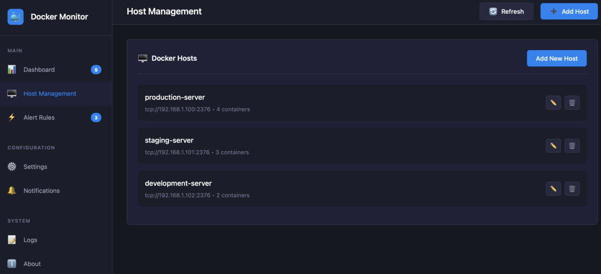
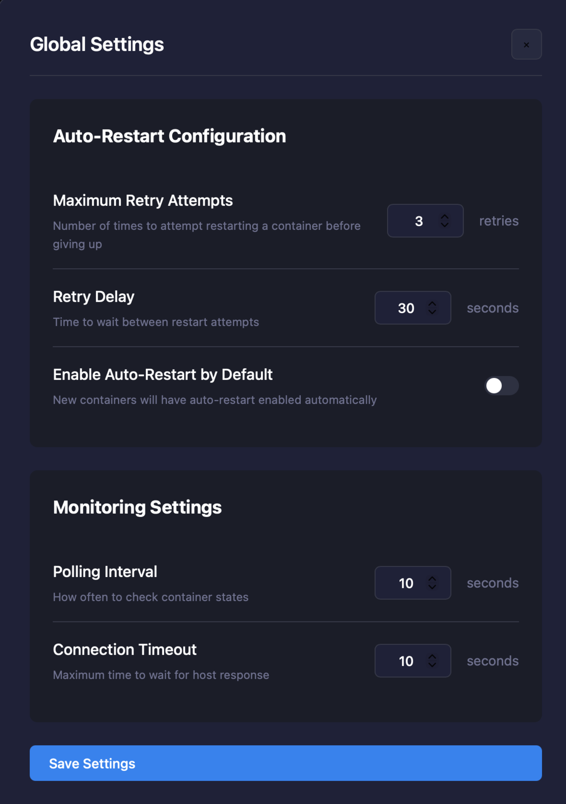

# DockMon

A comprehensive Docker container monitoring and management platform with real-time monitoring, intelligent auto-restart, multi-channel alerting, and complete event logging.


## Screenshots

### Dashboard Overview

*Real-time monitoring of multiple Docker hosts with container status and auto-restart controls*

### Container Management

*Individual container controls with auto-restart toggles and state monitoring*

### Settings Panel

*Configure global auto-restart policies and monitoring intervals*

## Core Features

### **Multi-Host Docker Monitoring**
- Monitor containers across unlimited Docker hosts (local and remote)
- Real-time container status tracking with WebSocket updates
- Support for TCP/TLS and Unix socket connections
- Automatic host connection health monitoring

### **Customizable Widget Dashboard**
- **Drag-and-drop interface** for intuitive dashboard customization
- **Resizable widgets** for personalized dashboard layouts
- **Persistent layout** saves your custom arrangement
- **Lock/unlock mode** to prevent accidental changes
- **12-column responsive grid** adapts to any screen size

### **Intelligent Auto-Restart System**
- Per-container auto-restart configuration
- Configurable retry attempts (0-10) and delays (5-300 seconds)
- Smart failure detection with exponential backoff
- Automatic disable after max attempts reached
- Comprehensive logging of all restart attempts

### **Advanced Alerting & Notifications**
- **Multi-channel support:** Discord, Telegram, Pushover
- **Flexible alert rules** with regex pattern matching
- **Cooldown periods** to prevent notification spam
- **State-based triggers** (container start, stop, crash, etc.)
- **Real-time notification delivery** with success tracking

### **Comprehensive Event Logging**
- **Complete audit trail** of all container and system events
- **Structured event categorization** (container, host, system, alert, notification)
- **Severity levels** (debug, info, warning, error, critical)
- **Correlation tracking** for related events
- **Performance metrics** with operation timing
- **Advanced filtering and search** capabilities
- **Automatic cleanup** with configurable retention

### **Container Management**
- Start, stop, restart containers remotely
- View real-time container logs
- Execute commands inside containers
- Live container statistics (CPU, memory, network, I/O)
- Container lifecycle management

### **Modern Architecture**
- **FastAPI backend** with async/await for high performance
- **WebSocket real-time updates** for instant UI refresh
- **SQLite database** for persistent configuration and event storage
- **Modern dark UI** inspired by Portainer
- **RESTful API** for programmatic access
- **Responsive design** works on all devices

## Quick Start

### Option 1: Docker Deployment (Recommended)

Clone and run with Docker Compose for full functionality:

```bash
git clone https://github.com/darthnorse/dockmon.git
cd dockmon
docker compose up -d
```

**Access URLs:**
- **Frontend UI:** `http://localhost:8001`
- **Backend API:** `http://localhost:8080`
- **API Documentation:** `http://localhost:8080/docs` (Swagger UI)

**Services Started:**
- `dockmon-backend` - FastAPI backend with database
- `dockmon-frontend` - Nginx serving the web interface

**Docker Socket Access:**
The backend automatically mounts `/var/run/docker.sock` for local Docker monitoring.

### Option 2: Proxmox LXC Container Deployment

#### Automated Installation (Recommended)

Run this single command on your Proxmox host:

```bash
curl -sSL https://raw.githubusercontent.com/darthnorse/dockmon/main/scripts/dockmon-lxc.sh | bash
```

Or download and run the script:

```bash
wget https://raw.githubusercontent.com/darthnorse/dockmon/main/scripts/dockmon-lxc.sh
chmod +x dockmon-lxc.sh
./dockmon-lxc.sh
```

The script will:
- Let you choose between Debian 12 or 13
- Prompt for root password and configure networking
- Install Python 3.11, nginx, and all dependencies
- Set up the FastAPI backend with virtual environment
- Configure systemd services and supervisor for reliability
- Create and start both frontend and backend services
- Set up the `update` command for easy maintenance

#### Keeping DockMon Updated

Once installed, simply SSH into your container and run:

```bash
update
```

This will update both Debian and DockMon to the latest versions.

#### Manual Installation (Alternative)

If you prefer to create the container manually:

1. Create an LXC container with Debian 12 or 13
2. Start the container and SSH into it
3. Run these commands:

```bash
# Update system and install dependencies
apt update && apt upgrade -y
apt install -y git nginx curl python3 python3-pip python3-venv supervisor

# Clone DockMon
cd /opt
git clone https://github.com/darthnorse/dockmon.git

# Set up Python backend
cd /opt/dockmon/backend
python3 -m venv venv
source venv/bin/activate
pip install -r requirements.txt

# Set up frontend
cp /opt/dockmon/src/index.html /var/www/html/index.html

# Configure services (see installation script for complete systemd setup)
systemctl enable nginx supervisor
systemctl start nginx supervisor
```

**Access URLs:**
- **Frontend:** `http://<container-ip>:8001`
- **Backend API:** `http://<container-ip>:8080`

### Option 3: Direct Deployment (Any Linux Server)

For any Debian/Ubuntu based system with full backend:

```bash
# Install dependencies
sudo apt update && apt install -y nginx git python3 python3-pip python3-venv supervisor

# Clone and set up DockMon
cd /opt
sudo git clone https://github.com/darthnorse/dockmon.git
cd /opt/dockmon/backend

# Set up Python environment
sudo python3 -m venv venv
sudo ./venv/bin/pip install -r requirements.txt

# Set up frontend
sudo cp /opt/dockmon/src/index.html /var/www/html/index.html

# Configure and start services
sudo systemctl enable nginx supervisor
sudo systemctl start nginx supervisor
```

**Note:** For production deployment, configure proper systemd services (see LXC script for examples).

## Configuration & Setup

### First Time Setup

1. **Access the Web Interface**
   - Navigate to your DockMon frontend URL
   - The interface will guide you through initial setup

2. **Add Docker Hosts**
   - Click "Add Host" in the dashboard
   - Configure connection details (local or remote Docker hosts)
   - Test connection before saving

3. **Configure Notification Channels** (Optional)
   - Go to Settings → Notifications
   - Set up Discord, Telegram, and/or Pushover

4. **Create Alert Rules** (Optional)
   - Go to Settings → Alert Rules
   - Define which containers trigger notifications

### Docker Remote Access Configuration

To monitor remote Docker hosts, you need to configure the Docker daemon to accept remote connections.

#### Enable Remote Access on Target Host

By default, Docker only listens on a Unix socket and doesn't accept remote connections. Follow these steps on each remote Docker host you want to monitor:

**Method 1: Using systemd override (Recommended)**

1. Create a systemd override file:
```bash
sudo systemctl edit docker
```

2. Add the following content:
```ini
[Service]
ExecStart=
ExecStart=/usr/bin/dockerd -H unix:///var/run/docker.sock -H tcp://0.0.0.0:2376
```

3. Restart Docker:
```bash
sudo systemctl daemon-reload
sudo systemctl restart docker
```

4. Verify Docker is listening on port 2376:
```bash
ss -tlnp | grep docker
```

**Method 2: Using daemon.json (Alternative)**

1. Create or edit `/etc/docker/daemon.json`:
```bash
sudo nano /etc/docker/daemon.json
```

2. Add the following content:
```json
{
  "hosts": ["unix:///var/run/docker.sock", "tcp://0.0.0.0:2376"]
}
```

3. Restart Docker:
```bash
sudo systemctl restart docker
```

**Note:** If you get conflicts with systemd socket activation, use Method 1 instead.

#### Docker Host Connection Formats

When adding hosts in DockMon, use these formats:

- **Local Docker**: `unix:///var/run/docker.sock`
- **Remote Docker (TCP)**: `tcp://192.168.1.100:2376`
- **Remote Docker (custom port)**: `tcp://192.168.1.100:2375`

## Security: mTLS Configuration (Strongly Recommended)

### Why Use mTLS?

**⚠️ CRITICAL:** Running Docker API over plain TCP without TLS exposes your entire system to attack. Anyone who can reach port 2375/2376 can take complete control of your host.

mTLS (mutual TLS) provides:
- **Mutual authentication** - Both DockMon and Docker verify each other's identity
- **Encrypted communication** - All data is encrypted in transit
- **Certificate-based access** - Only clients with valid certificates can connect

### Quick mTLS Setup

We provide a script to generate all necessary certificates:

```bash
# On your Docker host, generate certificates
curl -sSL https://raw.githubusercontent.com/darthnorse/dockmon/main/scripts/setup-docker-mtls.sh | bash

# This creates in ~/.docker/certs/:
# - ca.pem (Certificate Authority)
# - server-cert.pem, server-key.pem (Server certificates)
# - client-cert.pem, client-key.pem (Client certificates)
```

Then configure Docker to use mTLS:

```bash
# Copy the generated systemd override file
sudo cp ~/.docker/systemd-override.conf /etc/systemd/system/docker.service.d/override.conf
sudo systemctl daemon-reload
sudo systemctl restart docker
```

In DockMon, add the host with:
- **URL**: `tcp://your-host:2376`
- **CA Certificate**: Upload `ca.pem`
- **Client Certificate**: Upload `client-cert.pem`
- **Client Key**: Upload `client-key.pem`

### Insecure Mode (Development Only)

**⚠️ NEVER USE IN PRODUCTION - SIGNIFICANT SECURITY RISK**

For isolated test environments only:
```ini
ExecStart=/usr/bin/dockerd -H unix:///var/run/docker.sock -H tcp://0.0.0.0:2375
```

Then connect with `tcp://192.168.1.100:2375` (no certificates needed)

### Security Best Practices

1. **Always use mTLS for remote connections** - Never expose Docker API without TLS
2. **Rotate certificates regularly** - Generate new certificates every 90-365 days
3. **Protect private keys** - Set permissions to 400, never commit to git
4. **Use firewall rules** - Restrict port 2376 to specific IPs if possible
5. **Monitor access logs** - Check Docker logs for unauthorized access attempts
6. **Secure database storage** - DockMon automatically sets secure permissions (600) on the SQLite database containing certificates

#### Troubleshooting

**Connection Refused Error:**
```
Failed to establish a new connection: [Errno 111] Connection refused
```
- Verify Docker daemon is listening: `ss -tlnp | grep docker`
- Check firewall settings: `sudo ufw status` or `iptables -L`
- Test connectivity: `telnet <host-ip> 2376`

**Systemd Conflicts:**
If you get systemd socket activation conflicts, always use Method 1 (systemd override) instead of daemon.json.

### Notification Channels Setup

#### Discord
```json
{
  "name": "Discord Alerts",
  "type": "discord",
  "config": {
    "webhook_url": "https://discord.com/api/webhooks/YOUR_WEBHOOK_URL"
  }
}
```

#### Telegram
```json
{
  "name": "Telegram Alerts",
  "type": "telegram",
  "config": {
    "bot_token": "YOUR_BOT_TOKEN",
    "chat_id": "YOUR_CHAT_ID"
  }
}
```

#### Pushover
```json
{
  "name": "Pushover Alerts",
  "type": "pushover",
  "config": {
    "app_token": "YOUR_APP_TOKEN",
    "user_key": "YOUR_USER_KEY"
  }
}
```

### Alert Rules Configuration

Create sophisticated alert rules with regex patterns:

```json
{
  "name": "Production Container Down",
  "container_pattern": "prod-.*",
  "trigger_states": ["exited", "dead"],
  "notification_channels": [1, 2],
  "cooldown_minutes": 15,
  "enabled": true
}
```

### Global Settings

- **Auto-restart attempts:** 0-10 retries
- **Retry delay:** 5-300 seconds between attempts
- **Polling interval:** How often to check container status
- **Event retention:** How long to keep event logs
- **Notification settings:** Global notification preferences

## Usage Examples

### Basic Workflow

1. **Add Docker Hosts**
   - Local Docker: `unix:///var/run/docker.sock`
   - Remote Docker: `tcp://192.168.1.100:2376` (with or without TLS)

2. **Configure Auto-Restart**
   - Enable per-container auto-restart
   - Set retry attempts and delay intervals
   - Monitor restart attempts in real-time

3. **Set Up Alerts**
   - Create notification channels (Discord, Telegram, Pushover)
   - Define alert rules with regex patterns
   - Test notifications before enabling

4. **Monitor & Manage**
   - View real-time container status
   - Restart, start, or stop containers remotely
   - View container logs and execute commands
   - Track all events in the comprehensive event log

## REST API Documentation

DockMon provides a comprehensive REST API for programmatic access:

### Core Endpoints

#### Container Management
```bash
# Get all containers
GET /api/containers

# Container actions
POST /api/hosts/{host_id}/containers/{container_id}/start
POST /api/hosts/{host_id}/containers/{container_id}/stop
POST /api/hosts/{host_id}/containers/{container_id}/restart

# Container logs and commands
GET /api/hosts/{host_id}/containers/{container_id}/logs?tail=100
POST /api/hosts/{host_id}/containers/{container_id}/exec
```

#### Host Management
```bash
# Manage Docker hosts
GET /api/hosts
POST /api/hosts
DELETE /api/hosts/{host_id}
```

#### Notification Channels
```bash
# Manage notification channels
GET /api/notifications/channels
POST /api/notifications/channels
PUT /api/notifications/channels/{channel_id}
DELETE /api/notifications/channels/{channel_id}
POST /api/notifications/channels/{channel_id}/test
```

#### Alert Rules
```bash
# Manage alert rules
GET /api/alerts
POST /api/alerts
DELETE /api/alerts/{rule_id}
```

#### Event Logging
```bash
# View and filter events
GET /api/events?category=container&severity=error&limit=50
GET /api/events/{event_id}
GET /api/events/correlation/{correlation_id}
GET /api/events/container/{container_id}
GET /api/events/host/{host_id}
GET /api/events/statistics
DELETE /api/events/cleanup?days=30
```

#### Settings
```bash
# Global configuration
GET /api/settings
POST /api/settings
```

### WebSocket Real-time Updates

Connect to `/ws` for real-time updates:

```javascript
const ws = new WebSocket('ws://localhost:8080/ws');

ws.onmessage = (event) => {
    const data = JSON.parse(event.data);

    switch(data.type) {
        case 'containers_update':
            // Handle container status updates
            break;
        case 'docker_event':
            // Handle Docker events
            break;
        case 'container_stats':
            // Handle real-time stats
            break;
    }
};
```

### API Authentication

Currently uses basic authentication. For production deployments, consider implementing:
- API keys for programmatic access
- JWT tokens for web interface
- Role-based access control

## Docker Hub

Coming soon:

```bash
docker pull darthnorse/dockmon:latest
docker run -d -p 8001:8001 -p 8080:8080 darthnorse/dockmon:latest
```

## Project Structure

```
dockmon/
├── backend/                    # FastAPI Backend
│   ├── main.py                # FastAPI application and routes
│   ├── database.py            # Database models and operations
│   ├── notifications.py       # Notification service (Discord, Telegram, Pushover)
│   ├── event_logger.py        # Comprehensive event logging system
│   ├── realtime.py           # WebSocket and real-time monitoring
│   ├── requirements.txt       # Python dependencies
│   ├── Dockerfile            # Backend container definition
│   └── data/                 # SQLite database storage
├── src/                       # Frontend
│   ├── index.html            # Main web interface
│   └── realtime.html         # Real-time monitoring interface
├── docker/                    # Docker configuration
│   ├── Dockerfile            # Frontend container definition
│   └── nginx.conf            # Nginx configuration
├── scripts/                   # Deployment scripts
│   ├── dockmon-lxc.sh        # Automated Proxmox LXC deployment
│   └── update.sh             # Update script with backend support
├── screenshots/               # Application screenshots
│   ├── dashboard.png
│   ├── containers.png
│   └── settings.png
├── docker-compose.yml         # Full-stack Docker Compose configuration
├── LICENSE                   # MIT License
└── README.md                 # This documentation
```

## Development

DockMon uses a modern full-stack architecture:

### Backend Development (FastAPI)

```bash
# Set up development environment
cd backend
python3 -m venv venv
source venv/bin/activate  # or `venv\Scripts\activate` on Windows
pip install -r requirements.txt

# Run development server
python main.py

# The backend will be available at http://localhost:8080
# API docs available at http://localhost:8080/docs
```

### Frontend Development

The frontend is a single HTML file with embedded CSS/JavaScript:

```bash
# Option 1: Open directly (basic testing)
open src/index.html

# Option 2: Use Python's HTTP server
python3 -m http.server 8001 --directory src

# Option 3: Use Node's http-server
npx http-server src -p 8001
```

### Full Development Stack

```bash
# Run both frontend and backend
docker compose up -d

# Or run manually:
# Terminal 1 - Backend
cd backend && python main.py

# Terminal 2 - Frontend
python3 -m http.server 8001 --directory src
```

### Database Development

- SQLite database stored in `backend/data/dockmon.db`
- Database schema auto-creates on first run
- Use SQLite browser for manual inspection
- Event logs and configuration persist between restarts

## Contributing

Contributions are welcome! Feel free to:
1. Fork the repository
2. Create a feature branch (`git checkout -b feature/AmazingFeature`)
3. Commit changes (`git commit -m 'Add some AmazingFeature'`)
4. Push to branch (`git push origin feature/AmazingFeature`)
5. Open a Pull Request

## Roadmap

### Completed (v1.0.0)
- [x] Full backend API with FastAPI
- [x] WebSocket support for real-time updates
- [x] Database persistence (SQLite)
- [x] Comprehensive event logging system
- [x] Multi-channel notifications (Discord, Telegram, Pushover)
- [x] Container management (logs, exec, lifecycle)
- [x] Auto-restart with intelligent retry logic

### Planned Features (v1.1+)

#### Enhanced Monitoring
- [ ] **Performance Metrics Dashboard** - CPU, memory, network graphs over time
- [ ] **Container Health Checks** - Custom health check definitions
- [ ] **Resource Usage Alerts** - Alert on CPU/memory thresholds
- [ ] **Log Analysis** - Search and filter container logs with regex
- [ ] **Configuration Export/Import** - Backup and restore settings

## License

MIT License - see [LICENSE](LICENSE) file for details

## Author

Created by [darthnorse](https://github.com/darthnorse)

## Show Your Support

Give a star if this project helped you!

## Development Notes

This project has been developed with **vibe coding** and **AI assistance** for full transparency. The architecture, implementation, and documentation have been created through collaborative human-AI development using Claude Code. This approach allowed for rapid development of a comprehensive, production-ready Docker monitoring solution with modern best practices.

The codebase includes:
- Clean, well-documented code with proper error handling
- Comprehensive test coverage considerations
- Modern async/await patterns throughout
- Robust database design with proper migrations
- Production-ready deployment configurations

---

**DockMon** - Keep your containers in check!