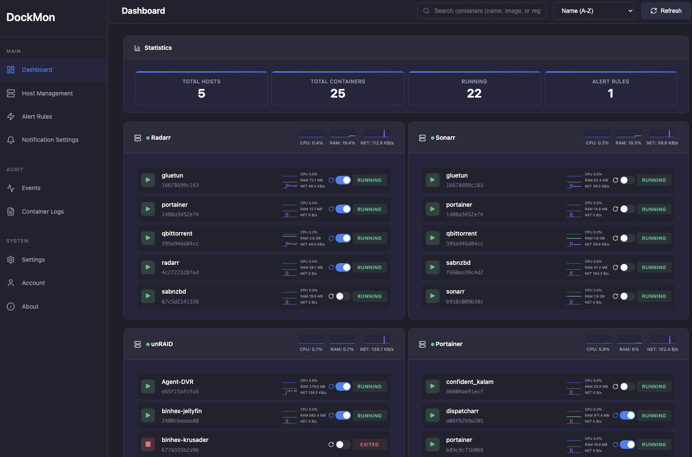

# DockMon

A comprehensive Docker container monitoring and management platform with real-time monitoring, intelligent auto-restart, multi-channel alerting, and complete event logging.

  

## Key Features

- **Multi-Host Monitoring** - Monitor containers across unlimited Docker hosts (local and remote)
- **Real-Time Dashboard** - Drag-and-drop customizable widgets with WebSocket updates
- **Real-Time Statistics** - Live CPU, memory, network metrics
- **Real-Time Container Logs** - View logs from multiple containers simultaneously with live updates
- **Event Viewer** - Comprehensive audit trail with filtering, search, and real-time updates
- **Intelligent Auto-Restart** - Per-container auto-restart with configurable retry logic
- **Advanced Alerting** - Discord, Slack, Telegram, Pushover, Gotify, SMTP with customizable templates
- **Container Tagging** - Automatic tag derivation from Docker labels with user-defined tags
- **Bulk Operations** - Start, stop, restart multiple containers simultaneously with progress tracking
- **Automatic Updates** - Detect and execute container image updates on schedule
- **HTTP/HTTPS Health Checks** - Custom endpoint monitoring with auto-restart on failure
- **Blackout Windows** - Schedule maintenance periods to suppress alerts
- **Secure by Design** - Session-based auth, rate limiting, mTLS for remote hosts, Alpine Linux base

## Documentation

- **[Complete User Guide](https://github.com/darthnorse/dockmon/wiki)** - Full documentation
- **[Quick Start](https://github.com/darthnorse/dockmon/wiki/Quick-Start)** - Get started in 5 minutes
- **[Installation](https://github.com/darthnorse/dockmon/wiki/Installation)** - Docker, unRAID, Synology, QNAP
- **[Configuration](https://github.com/darthnorse/dockmon/wiki/Notifications)** - Alerts, notifications, settings
- **[Security](https://github.com/darthnorse/dockmon/wiki/Security-Guide)** - Best practices and mTLS setup
- **[Remote Monitoring](https://github.com/darthnorse/dockmon/wiki/Remote-Docker-Setup)** - Monitor remote Docker hosts
- **[Event Viewer](https://github.com/darthnorse/dockmon/wiki/Event-Viewer)** - Comprehensive audit trail with filtering
- **[Container Logs](https://github.com/darthnorse/dockmon/wiki/Container-Logs)** - Real-time multi-container log viewer
- **[API Reference](https://github.com/darthnorse/dockmon/wiki/API-Reference)** - REST and WebSocket APIs
- **[FAQ](https://github.com/darthnorse/dockmon/wiki/FAQ)** - Frequently asked questions
- **[Troubleshooting](https://github.com/darthnorse/dockmon/wiki/Troubleshooting)** - Common issues

## Use Cases

### Home Lab
- Monitor all your Docker containers with beautiful real-time dashboards
- Get notified on multiple channels (Discord, Slack, Telegram, Email)
- Automatically restart failed containers with intelligent retry logic
- Track container events and changes with comprehensive audit trail
- Tag containers for better organization
- Health checks for mission-critical services

### Small Business / Self-Hosted
- Centralized monitoring across multiple servers
- Multi-channel alerting with customizable rules
- Automatic container updates to keep services current
- Health checks for mission-critical services
- Bulk operations for efficient container management
- Maintenance windows (blackout periods) during deployments

### Development Teams
- Monitor dev, staging, and production environments
- Quick container management (start, stop, restart, logs)
- Collaborative monitoring dashboard with real-time updates
- Alert history with correlation tracking
- Test notifications before deploying to production
- Bulk restart containers during deployments

## Support & Community

- **[Report Issues](https://github.com/darthnorse/dockmon/issues)** - Found a bug?
- **[Discussions](https://github.com/darthnorse/dockmon/discussions)** - Ask questions, share ideas
- **[Wiki](https://github.com/darthnorse/dockmon/wiki)** - Complete documentation
- **[Star on GitHub](https://github.com/darthnorse/dockmon)** - Show your support!

## Roadmap

### Completed (v1.0)
- [x] Full backend API with FastAPI
- [x] WebSocket real-time updates
- [x] Multi-channel notifications
- [x] Comprehensive event logging
- [x] Event log viewer with filtering and search
- [x] Real-time container logs viewer (multi-container support)
- [x] Drag-and-drop dashboard
- [x] Auto-restart with retry logic

### Completed (v1.1)
- [x] Real-time performance metrics (CPU, memory, network, disk I/O)
- [x] Host-level and container-level statistics
- [x] TLS/mTLS support for secure remote Docker connections
- [x] Optimized streaming architecture with Go backend

### Completed (v2.0) - Complete Rewrite
- [x] Modern React 18 frontend with TypeScript
- [x] Container tagging system with auto-derivation from Docker labels
- [x] Bulk operations (start/stop/restart multiple containers)
- [x] Automatic container updates with version tracking and scheduling
- [x] HTTP/HTTPS health checks with auto-restart on failure
- [x] Blackout windows for maintenance periods
- [x] Advanced alert rule engine with metric and event triggers
- [x] Alpine Linux base image with OpenSSL 3.x
- [x] Go 1.23 stats service for high-performance metrics streaming
- [x] Enhanced security and modern architecture

### Planned (v2.1+)
- [ ] Historical metrics graphs with trend analysis
- [ ] Configuration export/import
- [ ] Mobile-friendly responsive UI
- [ ] DockMon Agent for remote Docker hosts (avoid exposing Docker socket)
- [ ] Advanced RBAC and multi-user permissions

See the [full roadmap](https://github.com/darthnorse/dockmon/wiki/Roadmap) for details.

## Technology Stack

### Backend
- **Python 3.13** with FastAPI and async/await
- **Alpine Linux 3.x** container base (reduced attack surface)
- **OpenSSL 3.x** for modern cryptography
- **SQLAlchemy 2.0** with Alembic migrations
- **Go 1.23** stats service for real-time metrics streaming

### Frontend
- **React 18.3** with TypeScript (strict mode, zero `any`)
- **Vite** for fast development builds
- **TanStack Table** for data tables
- **React Grid Layout** for dashboard customization
- **Tailwind CSS** for styling

### Infrastructure
- **Multi-stage Docker build** - Go stats + React frontend + Python backend
- **Supervisor** for process management
- **Nginx** reverse proxy with SSL/TLS
- **WebSocket** for real-time updates
- **Health checks** for all services

## Upgrading from v1 to v2

### Breaking Changes
- **Alert Rules**: Old alert rules must be recreated using the new alert system
- **mTLS Certificates**: Regenerate certificates due to Alpine's stricter OpenSSL 3.x requirements
- **Database Schema**: Automatic one-time migration from v1.1.3 to v2.0.0

### Data Preserved
- ✅ Hosts and their configurations
- ✅ Containers and container history
- ✅ Event logs and audit trail
- ✅ User accounts and preferences

### Post-Upgrade Steps
1. Regenerate mTLS certificates for remote hosts (see [mTLS Setup Guide](https://github.com/darthnorse/dockmon/wiki/Security-Guide#mtls-setup))
2. Recreate alert rules using the new alert system
3. Verify host connections after upgrade

See the [Migration Guide](https://github.com/darthnorse/dockmon/wiki/Migration-Guide) for detailed instructions.

## Contributing

Contributions are welcome! Here's how you can help:

- Report bugs via [GitHub Issues](https://github.com/darthnorse/dockmon/issues)
- Suggest features in [Discussions](https://github.com/darthnorse/dockmon/discussions)
- Improve documentation (edit the [Wiki](https://github.com/darthnorse/dockmon/wiki))
- Submit pull requests (see [Contributing Guide](https://github.com/darthnorse/dockmon/wiki/Contributing))

## Development

Want to contribute code or run DockMon in development mode?

See [Development Setup](https://github.com/darthnorse/dockmon/wiki/Development-Setup) for:
- Local development environment setup
- Architecture overview
- Running tests
- Building from source

## License

MIT License - see [LICENSE](LICENSE) file for details.

## Author

Created by [darthnorse](https://github.com/darthnorse)

## Acknowledgments

This project has been developed with **vibe coding** and **AI assistance** using Claude Code. The codebase includes clean, well-documented code with proper error handling, comprehensive testing considerations, modern async/await patterns, robust database design, and production-ready deployment configurations.

---

  <strong>If DockMon helps you, please consider giving it a star!</strong>

  <a href="https://github.com/darthnorse/dockmon/wiki">Documentation</a> •
  <a href="https://github.com/darthnorse/dockmon/issues">Issues</a> •
  <a href="https://github.com/darthnorse/dockmon/discussions">Discussions</a>

