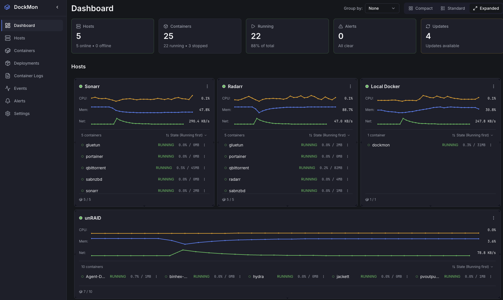

# DockMon

A comprehensive Docker container monitoring and management platform with real-time monitoring, intelligent auto-restart, multi-channel alerting, and complete event logging.


<p align="center">
  
</p>

## ✨ Key Features

- 🐳 **Multi-Host Monitoring** - Monitor containers across unlimited Docker hosts (local and remote)
- 🔄 **Intelligent Auto-Restart** - Per-container auto-restart with configurable retry logic
- 🚨 **Advanced Alerting** - Discord, Slack, Telegram, Pushover with customizable templates
- 📊 **Real-Time Dashboard** - Drag-and-drop customizable widgets with WebSocket updates
- 📝 **Event Logging** - Comprehensive audit trail of all container and system events
- 🔒 **Secure by Design** - Session-based auth, rate limiting, mTLS for remote hosts
- 📱 **Mobile-Friendly** - Responsive design that works seamlessly on all devices

## 🚀 Quick Start

```bash
git clone https://github.com/darthnorse/dockmon.git
cd dockmon
docker compose up -d
```

**Access:** `https://localhost:8001`
**Login:** `admin` / `dockmon123` (⚠️ **Change immediately on first login**)

> **Note:** You'll see a certificate warning (self-signed cert) - this is normal and safe. Click "Advanced" → "Proceed to localhost"

DockMon automatically configures local Docker monitoring on first run. No manual setup needed!

## 📖 Documentation

- **[📘 Complete User Guide](https://github.com/darthnorse/dockmon/wiki)** - Full documentation
- **[🚀 Quick Start](https://github.com/darthnorse/dockmon/wiki/Quick-Start)** - Get started in 5 minutes
- **[⚙️ Installation](https://github.com/darthnorse/dockmon/wiki/Installation)** - Docker, unRAID, Synology, QNAP
- **[🔧 Configuration](https://github.com/darthnorse/dockmon/wiki/Notifications)** - Alerts, notifications, settings
- **[🔐 Security](https://github.com/darthnorse/dockmon/wiki/Security-Guide)** - Best practices and mTLS setup
- **[🌐 Remote Monitoring](https://github.com/darthnorse/dockmon/wiki/Remote-Docker-Setup)** - Monitor remote Docker hosts
- **[🚀 API Reference](https://github.com/darthnorse/dockmon/wiki/API-Reference)** - REST and WebSocket APIs
- **[❓ FAQ](https://github.com/darthnorse/dockmon/wiki/FAQ)** - Frequently asked questions
- **[🐛 Troubleshooting](https://github.com/darthnorse/dockmon/wiki/Troubleshooting)** - Common issues

## 📸 Screenshots

<details>
<summary>Click to expand screenshots</summary>

### Dashboard Overview
Real-time monitoring of multiple Docker hosts with container status and auto-restart controls.


### Host Management
Manage multiple Docker hosts with connection status monitoring.


### Alert Rules & Notifications
Flexible alert system with multiple notification channels.


### Blackout Windows
Schedule quiet hours to suppress notifications during maintenance.


</details>

## 🎯 Use Cases

### Home Lab
- Monitor all your Docker containers in one place
- Get notified when critical services go down
- Automatically restart failed containers
- Track container events and changes

### Small Business
- Centralized monitoring across multiple servers
- Multi-channel alerting (Discord, Slack, Telegram)
- Schedule maintenance windows with blackout periods
- Audit trail of all container operations

### Development Teams
- Monitor dev, staging, and production environments
- Quick container management (start, stop, restart, logs)
- Test notifications before deploying to production
- Share monitoring dashboard with team

## 🆘 Support & Community

- 🐛 **[Report Issues](https://github.com/darthnorse/dockmon/issues)** - Found a bug?
- 💬 **[Discussions](https://github.com/darthnorse/dockmon/discussions)** - Ask questions, share ideas
- 📖 **[Wiki](https://github.com/darthnorse/dockmon/wiki)** - Complete documentation
- ⭐ **[Star on GitHub](https://github.com/darthnorse/dockmon)** - Show your support!

## 🗺️ Roadmap

### ✅ Completed (v1.0)
- [x] Full backend API with FastAPI
- [x] WebSocket real-time updates
- [x] Multi-channel notifications
- [x] Comprehensive event logging
- [x] Drag-and-drop dashboard
- [x] Auto-restart with retry logic

### 🔮 Planned (v1.1+)
- [ ] Performance metrics dashboard (CPU, memory, network graphs)
- [ ] Container health checks
- [ ] Log analysis and search
- [ ] Configuration export/import
- [ ] Automatic Proxmox LXC installation script

See the [full roadmap](https://github.com/darthnorse/dockmon/wiki/Roadmap) for details.

## 🤝 Contributing

Contributions are welcome! Here's how you can help:

- 🐛 Report bugs via [GitHub Issues](https://github.com/darthnorse/dockmon/issues)
- 💡 Suggest features in [Discussions](https://github.com/darthnorse/dockmon/discussions)
- 📝 Improve documentation (edit the [Wiki](https://github.com/darthnorse/dockmon/wiki))
- 🔧 Submit pull requests (see [Contributing Guide](https://github.com/darthnorse/dockmon/wiki/Contributing))

## 💻 Development

Want to contribute code or run DockMon in development mode?

See [Development Setup](https://github.com/darthnorse/dockmon/wiki/Development-Setup) for:
- Local development environment setup
- Architecture overview
- Running tests
- Building from source

## 📄 License

MIT License - see [LICENSE](LICENSE) file for details.

## 👨‍💻 Author

Created by [darthnorse](https://github.com/darthnorse)

## 🙏 Acknowledgments

This project has been developed with **vibe coding** and **AI assistance** using Claude Code. The codebase includes clean, well-documented code with proper error handling, comprehensive testing considerations, modern async/await patterns, robust database design, and production-ready deployment configurations.

---

<p align="center">
  ⭐ <strong>If DockMon helps you, please consider giving it a star!</strong> ⭐
</p>

<p align="center">
  <a href="https://github.com/darthnorse/dockmon/wiki">Documentation</a> •
  <a href="https://github.com/darthnorse/dockmon/issues">Issues</a> •
  <a href="https://github.com/darthnorse/dockmon/discussions">Discussions</a>
</p>